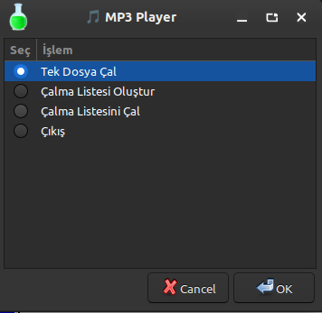
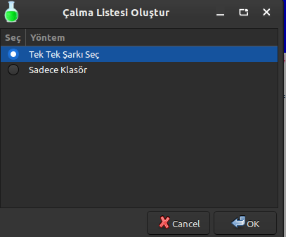
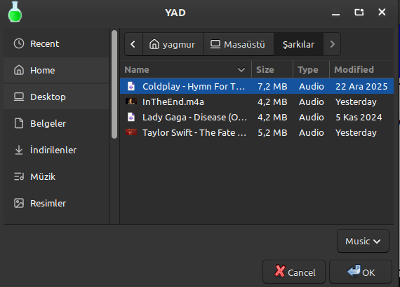
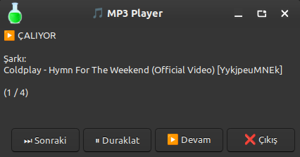
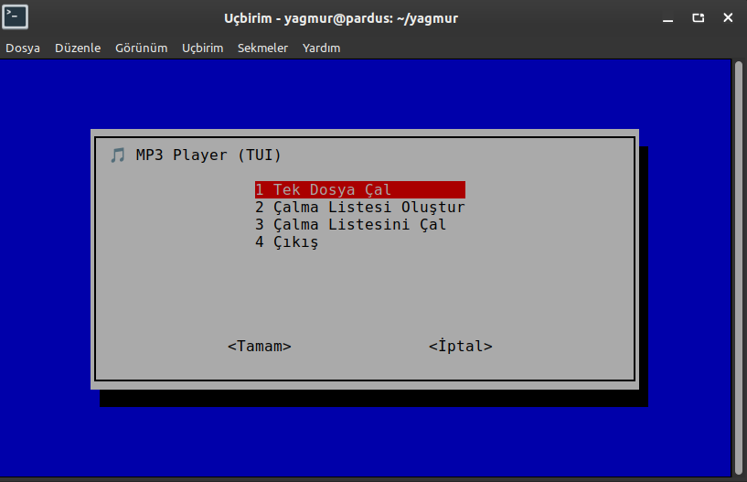
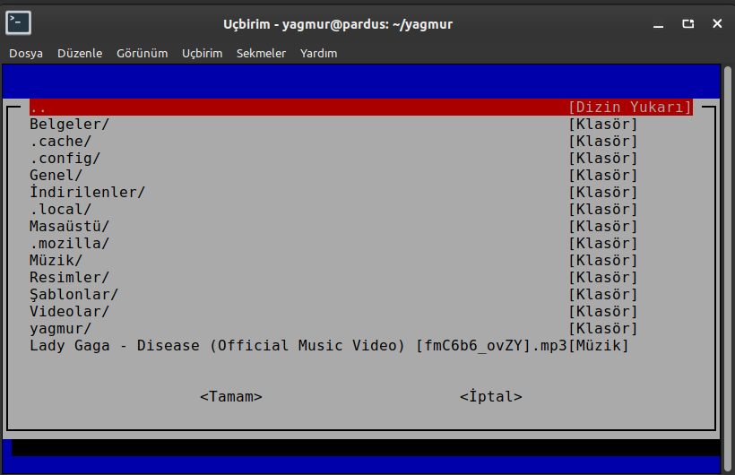
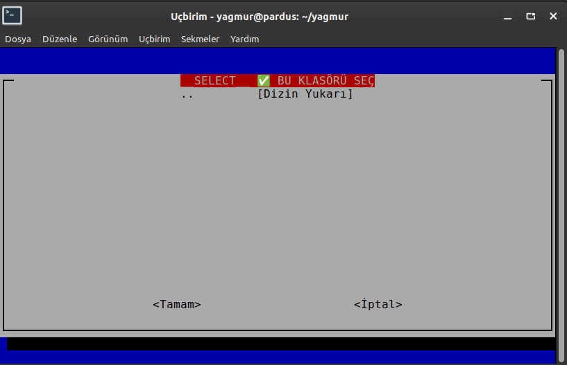
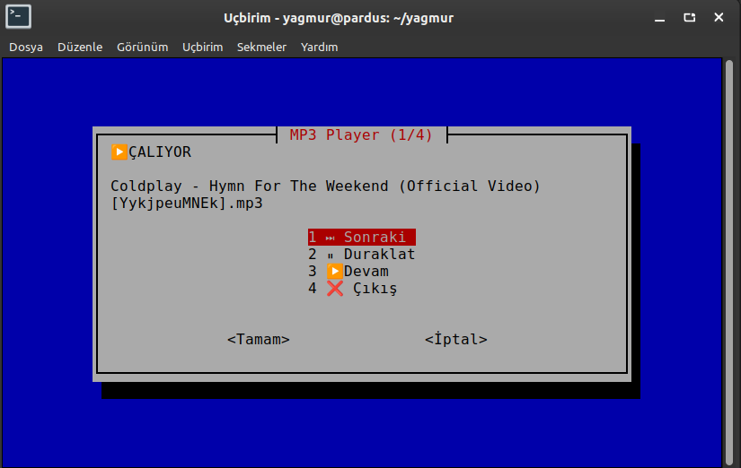

# 🎵 MP3 Player – GUI & TUI (Shell Script)

## Proje Tanıtımı
Bu proje, **Linux Scriptleri ve Araçları** dersi kapsamında geliştirilmiş bir **MP3 Müzik Çalar** uygulamasıdır.  
Uygulama, komut satırı tabanlı bir müzik oynatıcı olan **mpv** için hem **Grafiksel Kullanıcı Arayüzü (GUI)** hem de **Terminal Tabanlı Kullanıcı Arayüzü (TUI)** sunmaktadır.

Projenin temel amacı, Linux ortamında kullanılan CLI tabanlı araçlara **kullanıcı dostu arayüzler** kazandırmak ve bu arayüzlerin **Pardus Linux** üzerinde sorunsuz çalışmasını sağlamaktır.

---

## Projenin Amacı
- Shell Script (Bash) kullanarak gerçek bir Linux aracına arayüz geliştirmek
- Aynı uygulamanın GUI (YAD) ve TUI (Whiptail) sürümlerini oluşturmak
- Pardus Linux üzerinde çalışabilirlik sağlamak
- Kullanıcı deneyimini (UX) artırmak
- Playlist yönetimi ve müzik kontrolünü kolaylaştırmak

---

## Kullanılan Teknolojiler

| Bileşen | Teknoloji |
|--------|-----------|
| Programlama Dili | Bash (Shell Script) |
| GUI | YAD (Yet Another Dialog) |
| TUI | Whiptail |
| Müzik Oynatıcı | mpv |
| İşletim Sistemi | Pardus Linux (Debian tabanlı) |

---

## Proje Dosya Yapısı

```bash
gui.sh        # Grafik arayüzlü MP3 Player (YAD)
tui.sh        # Terminal arayüzlü MP3 Player (Whiptail)
install.sh    # Otomatik kurulum ve bağımlılık scripti
README.md     # Proje dokümantasyonu
```

---

## Sistem Gereksinimleri
- Pardus Linux (önerilen)
- Debian tabanlı Linux dağıtımı
- Gerekli paketler:
  - `mpv`
  - `yad`
  - `whiptail`

> Tüm bağımlılıklar **install.sh** tarafından otomatik olarak yüklenmektedir.

---

## Kurulum

### Depoyu Klonla
```bash
git clone https://github.com/kullanici-adi/mp3-player.git
cd mp3-player
```

### Kurulum Scriptini Çalıştır
```bash
chmod +x install.sh
./install.sh
```

Kurulum scripti aşağıdaki işlemleri otomatik olarak gerçekleştirir:
- İşletim sistemi kontrolü (Pardus / Debian)
- Gerekli paketlerin yüklenmesi (`mpv`, `yad`, `whiptail`)
- Script dosyalarına çalıştırma izni verilmesi
- İsteğe bağlı olarak GUI sürümünün başlatılması

---

## Kullanım

### GUI (Grafik Arayüz – YAD)
```bash
./gui.sh
```

**GUI Özellikleri**
- Tek dosya çalma
- Playlist oluşturma
- Tek tek şarkı seçme
- Klasör bazlı playlist
- Otomatik sonraki şarkıya geçiş
- Duraklat / Devam
- Şarkı adı ve playlist sıra bilgisinin gösterimi

---

### TUI (Terminal Arayüz – Whiptail)
```bash
./tui.sh
```

**TUI Özellikleri**
- Terminal içinden dosya ve klasör gezme
- Playlist oluşturma
- Otomatik şarkı geçişi
- Duraklat / Devam
- Menü tabanlı kontrol sistemi


---

## Ekran Görüntüleri

Bu bölümde uygulamanın hem **GUI (YAD)** hem de **TUI (Whiptail)** sürümlerine ait
temel ekran görüntüleri yer almaktadır. Görseller, uygulamanın kullanım akışını
ve sunduğu özellikleri göstermektedir.

---

### 🎨 GUI (Grafik Arayüz – YAD)

**GUI Ana Menü**  
Uygulamanın grafik arayüzlü ana menüsü. Kullanıcı buradan tek dosya çalma,
çalma listesi oluşturma ve playlist oynatma işlemlerini gerçekleştirebilir.



---

**GUI – Çalma Listesi Oluşturma Menüsü**  
Kullanıcının çalma listesi oluşturma yöntemini (tek tek şarkı veya klasör bazlı)
seçtiği ekran.



---

**GUI – Tek Dosya Çalma**  
Tek bir müzik dosyasının seçilerek oynatıldığı ekran.



---

**GUI – Klasör ile Çalma Listesi Oluşturma**  
Seçilen klasör içindeki müzik dosyalarından otomatik olarak çalma listesi
oluşturulan ekran.


---

**GUI – Çalma Listesi Çalma**  
Oluşturulan çalma listesinin oynatıldığı, şarkı bilgisi ve kontrol butonlarının
gösterildiği ekran.



---

### 💻 TUI (Terminal Arayüz – Whiptail)

**TUI Ana Menü**  
Terminal tabanlı arayüzün ana menüsü. Kullanıcı menü üzerinden tüm işlemleri
klavye ile kontrol edebilir.



---

**TUI – Çalma Listesi Oluşturma Menüsü**  
TUI sürümünde çalma listesi oluşturma yönteminin seçildiği ekran.


---

**TUI – Tek Dosya Çalma**  
Terminal üzerinden tek bir müzik dosyasının seçilip oynatıldığı ekran.



---

**TUI – Klasör ile Çalma Listesi Oluşturma**  
Seçilen klasör içerisindeki müzik dosyalarından playlist oluşturulan ekran.



---

**TUI – Çalma Listesi Çalma**  
Oluşturulan çalma listesinin terminal üzerinden oynatıldığı ve kontrol edildiği
ekran.



---

## Tanıtım Videosu
https://youtu.be/gURrdox8__0

---
